# SDA W7 - Manajemen Data Kota dan Penduduk

Repo ini berisi implementasi Struktur Data Algoritma untuk manajemen data kota dan penduduknya pakai linked list dengan pointer char sama pointer string. Cuss kita bahas!

## SK5 - Pointer Char

Di folder ini, saya bikin program buat nyimpen data kota sama penduduknya. Disini untuk linked list dari name atau penduduknya dinamis karena menggunakan malloc, Tetapi untuk city itu menggunakan statis karena harus input dulu di awal. Nah ini yang bikin beda kalau dibandingkan dengan SK6. 

Fitur dari SK5 ini antara lain:

* Karena dinamis awal awal harus nentuin sampai berapa kotanya
  
* Main menu dengan beberapa pilihan dan bercabang

  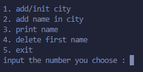
* Bisa bikin kota baru (dengan jumlah yang ditentuin di awal)

  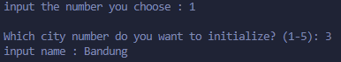
* Nambahin penduduk ke kota yang sudah ada

  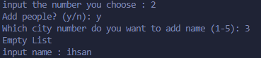
* Nampilin data penduduk di kota tertentu atau semua kota sekaligus

  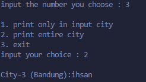
* Bisa hapus data penduduk yang paling awal

  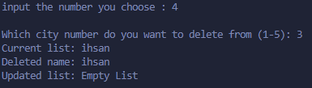

Program ini pake konsep linked list dengan pointer char untuk nyimpen nama penduduk dan kotanya, jadi memorinya dinamis.

## SK6 - Level Up dengan Dynamic Cities

Nah kalo SK6 ini udah next level, karena city dan peoplenya juga sudah dinamis. Jadi tidak fixed di awal. Selain bisa ngelakuin semua yang ada di SK5, program ini juga punya fitur tambahan yang makin keren:

* Menu yang lebih user friendly

  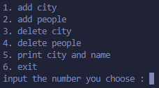
* Bisa nambahin kota (jumlahnya bisa dinamis, gak perlu fixed di awal)

  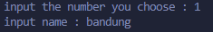

  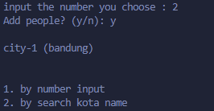

  - by search
    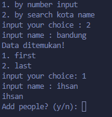
  - by number input

    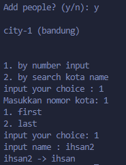
* Hapus penduduk lebih fleksibel (bisa yang pertama, terakhir, atau berdasarkan nama)

  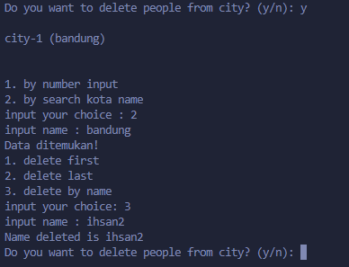
* Bisa Hapus kota (karena alokasi dinamis)

  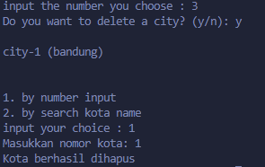

Yang paling asik, program ini lebih fleksibel karena kotanya juga udah dibikin jadi linked list, jadi jumlah kotanya bisa nambah-nambah sesuai kebutuhan.

## Yang Bikin Beda

SK5 sama SK6 emang sama-sama pake linked list, tapi ada perbedaan yang bikin mereka unik:

* SK5 pake array statis buat kotanya, sementara SK6 bikin kotanya juga jadi linked list
* SK6 ada fitur buat ngehapus kota (SK5 gak ada)
* SK6 punya opsi pencarian yang lebih lengkap
* SK5 lebih simpel, SK6 lebih kompleks tapi juga lebih powerful

...

Ntar saya tambahin lagi detailnya. Yang jelas program ini ngebantu banget buat yang lagi belajar konsep linked list dinamis dan penggunaan pointer dalam bahasa C. Cobain sendiri deh biar lebih paham!
